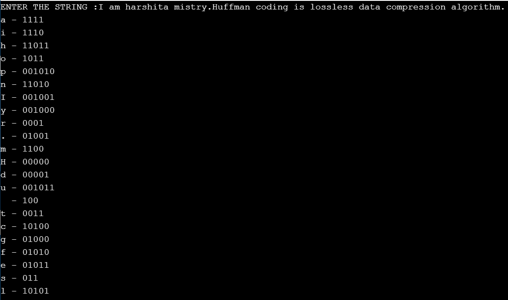
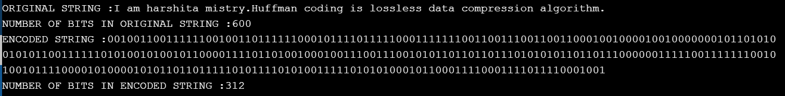

## Introduction-
Huffman Coding is one approach followed for Text Compression. Text
compression means reducing the space requirement for saving a particular text.
It is a GREEDY ALGORITHM which enables lossless data compression , ie. a way of
compressing data without the data losing any information in the process. It is
useful in cases where there is a series of frequently occurring characters

## Implementation of the Algorithm-
First-of-all, the Huffman Coding creates a tree by calculating the frequencies of each
character of the string and then assigns them some unique code so that we can
retrieve the data back using these codes.

### COMPRESSION-
1. Begin with calculating the frequency of each character value in the given
string.
2. Sort the characters in ascending order concerning their frequency and store
them in a priority queue, say Q.
3. Each character should be considered as a different leaf node.
4. Make an empty node, say z. The left child of z marked as the minimum
frequency and right child, the second minimum frequency. The value of z is
calculated by summing up the first two frequencies.
5. Now, remove the two characters with the lowest frequencies from the
priority queue Q and append their sum to the same.
6. Simply insert the above node z to the tree.
7. For every character in the string, repeat steps 3 to 5.
8. Assign 0 to the left side and 1 to the right side except for the leaf nodes.
9. Create a Huffman Encode Table containing Huffman codes for each character.
10. Encode the desired file.

> HUFFMAN ENCODED TABLE-

> HUFFMAN ENCODED TEXT-

### COMPRESSION RATIO-
The size of the compressed file is reduced to 52% of the original file.

### DECOMPRESSION-
1.To decode the Huffman codes, simply traverse through the tree (starting from the root) to find the character and as soon as you reach the leafnode, just print that character.

>DECOMPRESSED TEXT-

